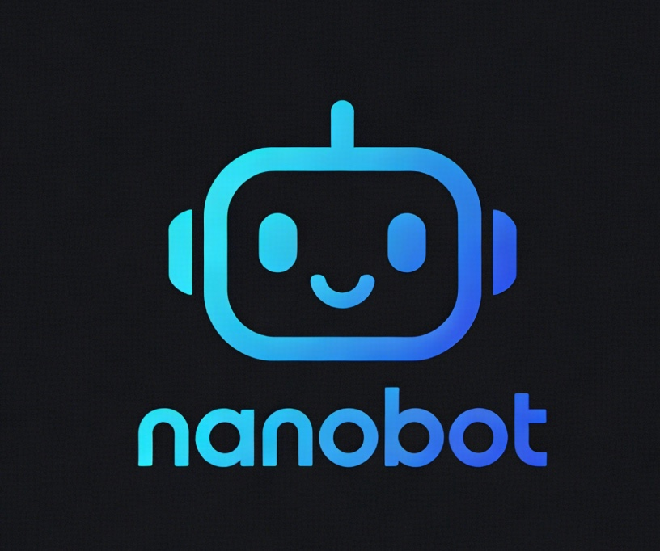
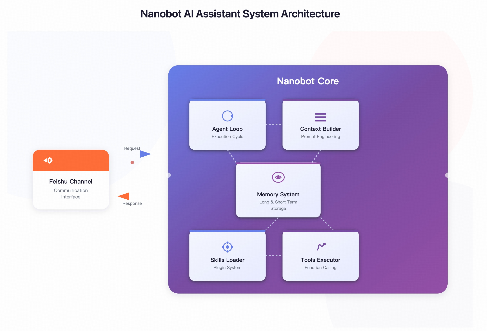

<!--
  ============================================================
  nanobot README 图片生成提示词 (供你到其他平台生成图片)
  ============================================================
  
  1. Logo 图片 (nanobot_logo.png)
  --------------------------------
  提示词: 
  "Create a minimalist, modern logo for an AI assistant called 'nanobot'. 
   The design should feature a cute robot face or symbol, using a color palette 
   of cyan/blue gradients on dark background. Tech-oriented, clean, vector style.
   The text 'nanobot' should be in a modern sans-serif font. 
   Overall aesthetic: futuristic, friendly, simple."
  
  尺寸建议: 500x200px
  
  2. 架构图 (nanobot_arch.jpeg)
  --------------------------------
  提示词:
  "Create a technical architecture diagram for an AI agent system called 'nanobot'.
   Show the following components in a clean, modern style:
   - CLI/Gateway at the top
   - Agent Loop in the center (connecting to LLM Providers: Anthropic, OpenAI)
   - Tools layer below (Shell, Web, Filesystem, Spawn, Message)
   - Channels on the right (Feishu)
   - Supporting services: Cron, Heartbeat, Session, Bus
   Use a dark theme with cyan/blue accent colors. 
   Flowing arrows showing data movement between components.
   Clean, professional technical illustration style."

  尺寸建议: 800x600px
-->

<div align="center">
  
  
  <h1>nanobot</h1>
  <p>Ultra-lightweight Personal AI Assistant (Bun/TypeScript Version)</p>
  
  <p>
    <a href="https://github.com/HKUDS/nanobot">
      
    </a>
    
    
    
  </p>
</div>

> **nanobot** 是一个超轻量级的个人 AI 助手，使用 **Bun + TypeScript** 重写，拥有极小的代码体积和闪电般的启动速度。

## ✨ 特性

| 特性 | 说明 |
|------|------|
| 🪶 **超轻量** | 使用 Bun 运行，代码简洁，启动速度极快 |
| 🔧 **易于扩展** | 基于 TypeScript，代码清晰易读，方便二次开发 |
| ⚡ **闪电般的速度** | Bun 运行时带来原生级别的性能 |
| 🛠️ **内置工具** | Shell 命令、网页搜索、文件系统操作、进程管理、截图等 |
| 📱 **多通道支持** | 支持飞书 (Feishu) 集成 |
| 🖼️ **图片理解** | 支持 Vision 模型理解图片内容 (Claude/GPT) |
| ⏰ **定时任务** | 内置 Cron 定时任务支持 |
| 💓 **心跳服务** | 定时主动唤醒执行任务 |

## 🏗️ 架构

<p align="center">
  
</p> 

```
┌─────────────────────────────────────────────────────────────┐
│                        CLI / Gateway                        │
└─────────────────────────┬───────────────────────────────────┘
                          │
┌─────────────────────────▼───────────────────────────────────┐
│                      Agent Loop                             │
│  ┌─────────────┐    ┌─────────────┐    ┌─────────────┐    │
│  │  Anthropic  │    │   OpenAI    │    │   Others... │    │
│  │   (Vision)  │    │   (Vision)  │    │   (Vision)  │    │
│  └──────┬──────┘    └──────┬──────┘    └──────┬──────┘    │
└─────────┼───────────────────┼───────────────────┼───────────┘
          │                   │                   │
┌─────────▼───────────────────▼───────────────────▼───────────┐
│                        Tools                                │
│  ┌────────┐  ┌────────┐  ┌──────────┐  ┌────────┐        │
│  │ Shell  │  │  Web   │  │FileSystem│  │ Spawn  │  ...   │
│  └────────┘  └────────┘  └──────────┘  └────────┘        │
└────────────────────────────────────────────────────────────┘
                          │
    ┌─────────────────────┼─────────────────────┐
    │                     │                     │
    ▼                     ▼                     ▼
┌─────────┐          ┌─────────┐          ┌─────────┐
│ Feishu  │          │  Cron   │          │Heartbeat│
│Channel  │          │ Tasks   │          │ Service │
│(Vision) │          └─────────┘          └─────────┘
└─────────┘
```

## 📦 安装

### 前置要求

- [Bun](https://bun.sh/) ≥ 1.0

```bash
# 安装 Bun (如果没有)
curl -fsSL https://bun.sh/install | bash
```

### 克隆项目

```bash
git clone https://github.com/HKUDS/nanobot.git
cd nanobot
bun install
```

### 编译为二进制 (可选)

```bash
# 本平台编译
make build-binary

# 跨平台编译
make build-linux-x64    # Linux x64
make build-linux-arm64  # Linux ARM64
make build-windows-x64  # Windows x64
make build-darwin-x64   # macOS x64
make build-darwin-arm64 # macOS ARM64

# 编译所有平台
make build-all
```

编译产物在 `bin/` 目录下。

## 🚀 快速开始

### 1. 初始化

```bash
# 使用 bun 运行
bun run src/cli/commands.ts onboard

# 或使用编译后的二进制
./bin/nanobot onboard
```

这会创建：
- `~/.nanobot/config.json` - 配置文件
- `~/.nanobot/AGENTS.md` - Agent 指令
- `~/.nanobot/SOUL.md` - 人格设定
- `~/.nanobot/USER.md` - 用户信息
- `~/.nanobot/memory/MEMORY.md` - 长期记忆

### 2. 配置 API Key

编辑 `~/.nanobot/config.json`：

<details>
<summary><b>Anthropic (Claude)</b></summary>

```json
{
  "providers": {
    "anthropic": {
      "apiKey": "sk-ant-api03-xxx"
    }
  },
  "agents": {
    "defaults": {
      "model": "claude-sonnet-4-20250514"
    }
  }
}
```

获取 API Key: [Anthropic Console](https://console.anthropic.com/settings/keys)

</details>

<details>
<summary><b>OpenAI (GPT-4)</b></summary>

```json
{
  "providers": {
    "openai": {
      "apiKey": "sk-proj-xxx"
    }
  },
  "agents": {
    "defaults": {
      "model": "gpt-4o"
    }
  }
}
```

获取 API Key: [OpenAI Platform](https://platform.openai.com/api-keys)

</details>

### 3. 开始对话

```bash
# 单次对话
bun run src/cli/commands.ts agent -m "你好"

# 交互模式
bun run src/cli/commands.ts agent

# 或使用二进制
./bin/nanobot agent -m "你好"
```

## 💬 使用 Makefile

```bash
# 开发
make install      # 安装依赖
make build        # 构建 TypeScript
make test         # 运行测试

# 运行
make agent        # 交互模式
make run MSG='Hello'  # 单次对话
make gateway      # 启动网关服务

# 定时任务
make cron-list              # 查看任务
make cron-add NAME='daily' MSG='Good morning' EVERY=3600  # 添加任务

# 编译二进制
make build-binary           # 本平台
make build-all             # 所有平台
```

完整命令请运行 `make help`。

## 💬 飞书集成

### 1. 创建应用

1. 访问 [飞书开放平台](https://open.feishu.cn/)
2. 创建新应用
3. 获取 `app_id` 和 `app_secret`
4. 订阅 `im.message.receive_v1` 事件
5. 启用 WebSocket 连接

### 2. 配置

编辑 `~/.nanobot/config.json`：

```json
{
  "channels": {
    "feishu": {
      "enabled": true,
      "app_id": "YOUR_APP_ID",
      "app_secret": "YOUR_APP_SECRET",
      "allowFrom": []
    }
  }
}
```

### 3. 运行

```bash
bun run src/cli/commands.ts gateway
# 或
./bin/nanobot gateway
```

## 🖼️ 图片理解

飞书通道支持发送图片进行理解：

1. 在飞书中直接发送图片消息
2. nanobot 会自动下载图片并转换为 base64
3. 将图片发送给 Vision 模型进行分析
4. 返回图片内容的理解结果

**支持的模型：**
- Anthropic: Claude (所有 vision 模型)
- OpenAI: GPT-4o, GPT-4o-mini

## ⚙️ 配置说明

配置文件: `~/.nanobot/config.json`

### 完整配置示例

```json
{
  "agents": {
    "defaults": {
      "model": "gpt-4o",
      "max_tool_iterations": 100
    }
  },
  "providers": {
    "anthropic": {
      "apiKey": "sk-ant-api03-xxx",
      "apiBase": "https://api.anthropic.com"
    },
    "openai": {
      "apiKey": "sk-proj-xxx",
      "apiBase": "https://api.openai.com/v1"
    }
  },
  "channels": {
    "feishu": {
      "enabled": true,
      "app_id": "YOUR_APP_ID",
      "app_secret": "YOUR_APP_SECRET",
      "allowFrom": []
    }
  }
}
```

## 🧩 内置工具

| 工具 | 说明 |
|------|------|
| `shell` | 执行 Shell 命令 |
| `web` | 网页搜索 (需要 Tavily API) |
| `filesystem` | 文件系统操作 (读/写/删除/编辑) |
| `spawn` | 启动子进程 |
| `message` | 发送消息到通道 |
| `screenshot` | 屏幕截图 |

## 📁 项目结构

```
nanobot/
├── src/
│   ├── agent/          # 🧠 核心 Agent 逻辑
│   │   ├── loop.ts     #    Agent 循环 (LLM ↔ 工具执行)
│   │   ├── context.ts  #    上下文构建，图片理解
│   │   ├── memory.ts   #    长期记忆
│   │   ├── skills.ts   #    Skills 加载器
│   │   ├── subagent.ts #    子任务执行
│   │   └── tools/      #    内置工具
│   ├── channels/       # 📱 通道集成 (飞书)
│   ├── bus/            # 🚌 消息路由
│   ├── cron/           # ⏰ 定时任务
│   ├── heartbeat/      # 💓 心跳服务
│   ├── providers/      # 🤖 LLM 提供商 (支持 Vision)
│   ├── session/        # 💬 会话管理
│   ├── config/         # ⚙️ 配置加载
│   ├── cli/            # 🖥️ 命令行
│   └── skills/         # 🎯 技能包
├── bin/                 # 编译后的二进制
├── Makefile            # 构建脚本
├── VERSION             # 版本号
└── package.json
```

## 🤝 贡献

欢迎提交 PR！代码简洁易读，非常适合学习和二次开发。

## 📄 许可证

MIT License

---

<p align="center">
  <em>感谢使用 nanobot! ✨</em>
</p>
