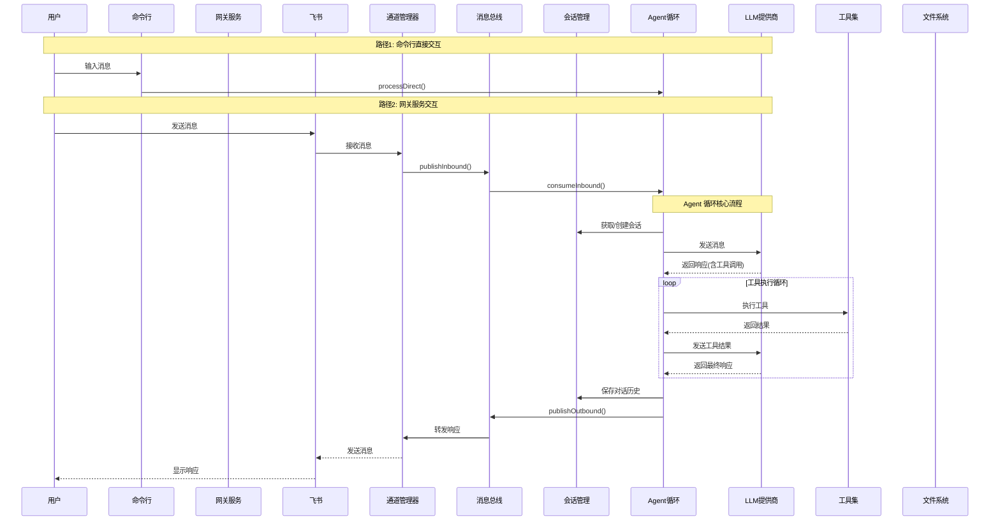
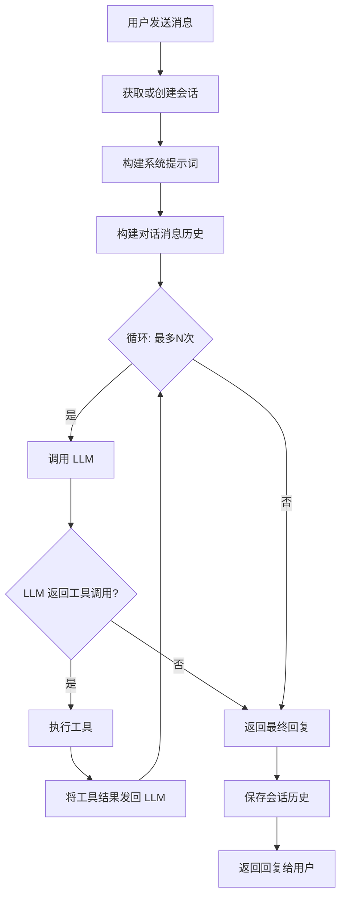
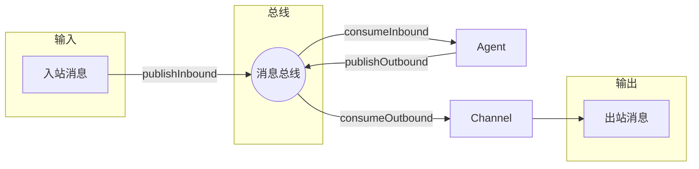
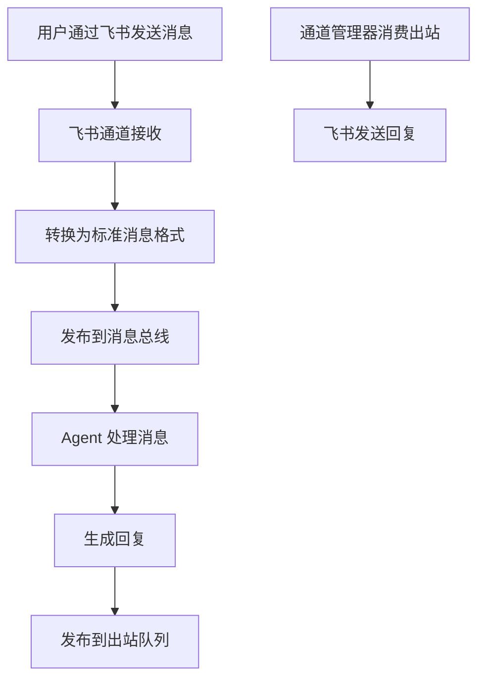
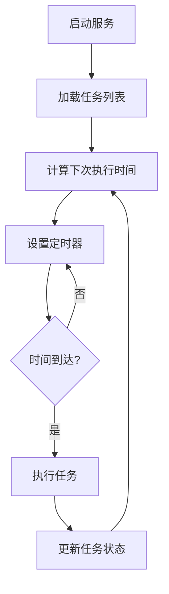
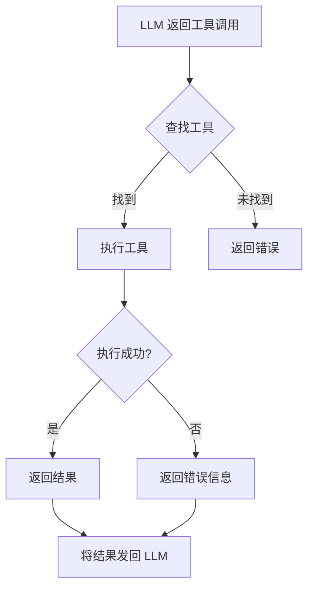

# nanobot 产品架构说明文档

## 1. 业务概述

### 1.1 什么是 nanobot

nanobot 是一个**超轻量级的个人 AI 助手**，它的核心目标是用最少的代码（约 4000 行）实现完整的 AI Agent 功能。相比于其他复杂的 AI 框架（如 Clawdbot 的 43 万行代码），nanobot 仅有其 1% 的大小，因此也被称为 "nano"（纳米）级别的机器人。

### 1.2 产品定位

- **个人 AI 助手**：帮助用户完成各种任务，如回答问题、执行命令、搜索信息等
- **多通道接入**：支持通过飞书、命令行等多种渠道与用户交互
- **可扩展工具**：内置多种工具（Shell、文件操作、网页搜索等），同时支持 MCP 扩展

### 1.3 核心特性

| 特性 | 说明 |
|------|------|
| 🪶 超轻量 | 仅约 4000 行代码，启动快、资源占用低 |
| 🔧 易扩展 | 基于 TypeScript，代码清晰易读 |
| ⚡ 闪电速度 | 使用 Bun 运行时，性能优异 |
| 🛠️ 工具丰富 | Shell、网页、文件、子进程管理等 |
| 📱 多通道 | 支持飞书集成 |
| ⏰ 定时任务 | 内置 Cron 任务调度 |
| 💓 心跳服务 | 定时主动唤醒执行任务 |

---

## 2. 系统架构图

### 2.1 整体架构

```mermaid
graph TB
    subgraph 用户层
        CLI[命令行 CLI]
        Gateway[网关服务]
        Feishu[飞书消息]
    end
    
    subgraph 核心层
        AgentLoop[Agent 循环引擎]
        ContextBuilder[上下文构建器]
        SkillsLoader[技能加载器]
        SessionManager[会话管理器]
    end
    
    subgraph LLM 层
        Anthropic[Anthropic (Claude)]
        OpenAI[OpenAI (GPT)]
    end
    
    subgraph 工具层
        Shell[Shell 工具]
        Web[网页工具]
        FileSystem[文件系统工具]
        Spawn[子进程工具]
        Message[消息工具]
    end
    
    subgraph 服务层
        Cron[定时任务服务]
        Heartbeat[心跳服务]
        Bus[消息总线]
        ChannelManager[通道管理器]
    end
    
    CLI --> AgentLoop
    Gateway --> ChannelManager
    Feishu --> ChannelManager
    ChannelManager --> Bus
    Bus --> AgentLoop
    
    AgentLoop --> ContextBuilder
    AgentLoop --> SkillsLoader
    AgentLoop --> SessionManager
    AgentLoop --> Anthropic
    AgentLoop --> OpenAI
    
    AgentLoop --> Shell
    AgentLoop --> Web
    AgentLoop --> FileSystem
    AgentLoop --> Spawn
    AgentLoop --> Message
    
    Cron --> AgentLoop
    Heartbeat --> AgentLoop
```

### 2.2 数据流向图



---

## 3. 核心模块详解

### 3.1 Agent 循环 (Agent Loop)

**模块职责**：这是 nanobot 的"心脏"，负责协调 LLM 和工具之间的交互。

**工作流程**（用通俗的话来说）：



**关键代码逻辑** (`src/agent/loop.ts`)：

```typescript
// 伪代码展示核心循环
async processDirect(content: string, sessionKey: string): Promise<string> {
    // 1. 获取会话
    const session = this.sessions.getOrCreate(sessionKey);
    
    // 2. 构建消息（包括系统提示 + 历史 + 当前输入）
    const messages = [
        { role: "system", content: this.context.buildSystemPrompt() },
        ...session.getHistory(),
        { role: "user", content }
    ];
    
    // 3. 循环调用 LLM 和工具
    while (iteration < maxIterations) {
        // 调用 LLM
        const response = await this.provider.chat({
            messages,
            tools: this.tools.get_definitions()
        });
        
        // 如果 LLM 返回了工具调用
        if (response.toolCalls) {
            // 执行每个工具
            for (const toolCall of response.toolCalls) {
                const result = await this.tools.execute(
                    toolCall.name,
                    toolCall.arguments
                );
                // 将工具结果加入消息
                messages.push({
                    role: "tool",
                    content: result,
                    toolCallId: toolCall.id
                });
            }
        } else {
            // LLM 返回最终回复，退出循环
            finalContent = response.content;
            break;
        }
    }
    
    // 4. 保存会话
    session.addMessage("user", content);
    session.addMessage("assistant", finalContent);
    this.sessions.save(session);
    
    return finalContent;
}
```

### 3.2 上下文构建器 (Context Builder)

**模块职责**：负责构建发送给 LLM 的系统提示词（System Prompt），包括：

- Agent 指令 (AGENTS.md)
- 人格设定 (SOUL.md)
- 用户信息 (USER.md)
- 可用技能列表 (Skills)

**通俗理解**：就像你在与人对话前，会先给他一份"工作手册"，告诉他应该怎么做、有什么资源可用。Context Builder 就是制作这份手册的"秘书"。

### 3.3 技能加载器 (Skills Loader)

**模块职责**：动态加载和管理"技能包"（Skills）。

**技能是什么**：Skill 是预先封装好的工具集合，比如：
- `github` 技能：帮你操作 GitHub
- `tmux` 技能：帮你管理终端会话
- `skill-manager` 技能：管理其他技能

**加载方式**：
- **always-skills**：每次都自动加载
- **按需加载**：根据用户需求动态加载

### 3.4 会话管理 (Session Manager)

**模块职责**：管理对话历史，让 Agent 能"记住"之前的对话内容。

**通俗理解**：就像微信的聊天记录，会话管理负责：
- 创建新会话
- 保存对话历史到文件
- 读取历史对话
- 会话过期管理

**存储格式**：使用 JSONL（JSON Lines）格式，每行一个 JSON 对象：

```json
{"_type":"metadata","created_at":"2026-01-01T00:00:00.000Z","updated_at":"2026-01-01T00:00:00.000Z","metadata":{}}
{"role":"user","content":"你好"}
{"role":"assistant","content":"你好！有什么可以帮你的吗？"}
{"role":"user","content":"今天天气怎么样"}
{"role":"assistant","content":"让我查一下...今天天气晴朗，25度"}
```

---

## 4. 通道与消息路由

### 4.1 消息总线 (Message Bus)

**模块职责**：负责在不同组件之间传递消息，是系统的"交通枢纽"。



**两种消息类型**：
1. **入站消息 (Inbound)**：从用户到 Agent
2. **出站消息 (Outbound)**：从 Agent 到用户

### 4.2 通道管理器 (Channel Manager)

**模块职责**：管理各种消息通道（目前主要是飞书），负责：
- 启动/停止通道
- 接收用户消息
- 发送回复给用户

**支持的通道**：
- **飞书 (Feishu)**：企业沟通工具
- **CLI**：命令行直接交互



### 4.3 飞书集成

**工作原理**：
1. 在飞书开放平台创建应用
2. 配置 Webhook 接收消息
3. nanobot 通过飞书 API 发送回复

**配置项**：
```json
{
  "channels": {
    "feishu": {
      "enabled": true,
      "app_id": "YOUR_APP_ID",
      "app_secret": "YOUR_APP_SECRET",
      "allowFrom": ["open_id_1", "open_id_2"]
    }
  }
}
```

---

## 5. 定时任务与心跳服务

### 5.1 定时任务服务 (Cron Service)

**模块职责**：按照预定的时间表自动执行任务。

**类似**：手机闹钟 到点就响

**支持的调度方式**：

| 类型 | 示例 | 说明 |
|------|------|------|
| `every` | 每小时 | 每隔固定时间执行 |
| `cron` | 每天 9:00 | 使用 Cron 表达式 |
| `at` | 2026-01-01 00:00 | 在指定时间执行一次 |

**使用示例**：
```bash
# 每天早上 9 点发送问候
nanobot cron add --name "morning" --message "早安!" --cron "0 9 * * *"

# 每小时检查一次
nanobot cron add --name "hourly-check" --message "检查状态" --every 3600
```

**核心逻辑**：


### 5.2 心跳服务 (Heartbeat Service)

**模块职责**：定时主动检查并执行任务，就像"心跳"一样定期触发。

**通俗理解**：就像你设定的"每日待办事项提醒"，到点就检查一下有没有需要处理的事情。

**工作流程**：
1. 定期（默认 30 分钟）读取 `HEARTBEAT.md` 文件
2. 如果文件有内容，执行文件中的任务
3. 如果返回 "HEARTBEAT_OK"，说明不需要操作

**HEARTBEAT.md 示例**：
```markdown
# 待办任务

- [ ] 检查服务器状态
- [ ] 发送日报
- [ ] 清理临时文件
```

**配置**：
- 默认间隔：30 分钟
- 可自定义间隔时间

---

## 6. LLM 提供商

### 6.1 支持的模型

| 提供商 | 模型示例 | 说明 |
|--------|----------|------|
| Anthropic | Claude Sonnet 4 | 默认推荐 |
| OpenAI | GPT-4o | 支持推理分离 |
| 本地模型 | Llama 3.1 | 支持 Anthropic 兼容 API |

### 6.2 Anthropic 提供商

**特点**：
- 使用原生 Anthropic API
- 支持 Claude 所有模型
- 支持工具调用（Tool Use）

**代码位置**：`src/providers/anthropic.ts`

### 6.3 OpenAI 提供商

**特点**：
- 使用 OpenAI API
- 支持 GPT-4o 系列
- 支持 `reasoning_split` 推理分离功能

---

## 7. 工具系统

### 7.1 内置工具

| 工具名称 | 功能 | 示例 |
|----------|------|------|
| `shell` | 执行 Shell 命令 | `ls -la`, `git status` |
| `web` | 网页搜索 | 搜索最新新闻 |
| `filesystem` | 文件操作 | 读、写、编辑文件 |
| `spawn` | 启动子进程 | 运行后台任务 |
| `message` | 发送消息 | 通过通道发消息 |

### 7.2 工具注册与执行



### 7.3 MCP 扩展

MCP (Model Context Protocol) 允许连接外部服务，扩展 nanobot 的能力。

**配置示例**：
```json
{
  "mcp": {
    "enabled": true,
    "servers": [
      {
        "name": "github-tools",
        "url": "http://localhost:8000"
      }
    ]
  }
}
```

---

## 8. 配置系统

### 8.1 配置文件位置

- 用户配置：`~/.nanobot/config.json`
- 工作空间：`~/.nanobot/`

### 8.2 完整配置项

```json
{
  "agents": {
    "defaults": {
      "model": "claude-sonnet-4-20250514",
      "max_tool_iterations": 100
    }
  },
  "providers": {
    "anthropic": {
      "apiKey": "sk-ant-xxx",
      "apiBase": "https://api.anthropic.com"
    },
    "openai": {
      "apiKey": "sk-proj-xxx"
    }
  },
  "channels": {
    "feishu": {
      "enabled": true,
      "app_id": "xxx",
      "app_secret": "xxx"
    }
  },
  "cron": {
    "enabled": true
  },
  "heartbeat": {
    "enabled": true,
    "intervalSeconds": 1800
  }
}
```

### 8.3 工作空间文件

初始化后会创建以下文件：

| 文件 | 用途 |
|------|------|
| `config.json` | 配置文件 |
| `AGENTS.md` | Agent 指令/行为规范 |
| `SOUL.md` | 人格设定 |
| `USER.md` | 用户信息 |
| `HEARTBEAT.md` | 定时任务清单 |
| `memory/MEMORY.md` | 长期记忆 |

---

## 9. 使用场景

### 9.1 命令行交互

```bash
# 单次对话
nanobot agent -m "你好"

# 交互模式
nanobot agent
```

### 9.2 飞书集成

```bash
# 启动网关服务
nanobot gateway
```

### 9.3 定时任务

```bash
# 添加定时任务
nanobot cron add --name "daily" --message "早上好!" --cron "0 9 * * *"

# 查看任务列表
nanobot cron list
```

---

## 10. 技术栈

| 类别 | 技术 |
|------|------|
| 运行时 | Bun |
| 语言 | TypeScript |
| LLM SDK | Anthropic SDK, OpenAI SDK |
| 消息通道 | 飞书 API |
| 定时任务 | cron-parser |

---

## 11. 总结

nanobot 是一个设计精巧的 AI Agent 框架，它的核心设计哲学是：

1. **极简主义**：用最少的代码实现核心功能
2. **模块化**：各组件职责清晰，易于扩展
3. **多通道**：支持多种交互方式
4. **可自动化**：支持定时任务和心跳服务

通过本文档，您应该对 nanobot 有了全面的理解，包括：
- 系统整体架构
- 核心模块的职责和交互方式
- 数据如何在系统中流转
- 如何配置和使用系统

如果您想深入了解某个模块，可以查看对应的源代码文件。
