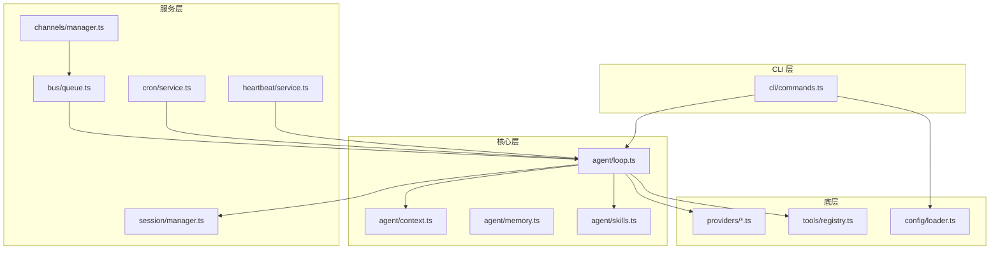
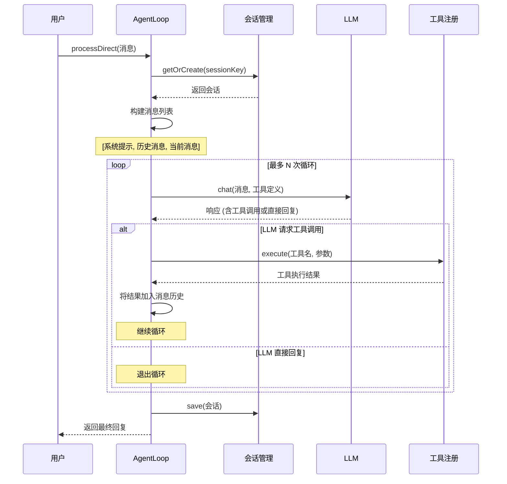
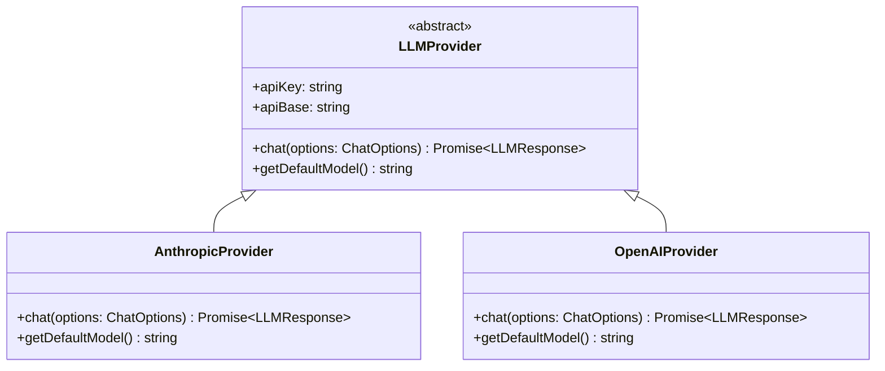
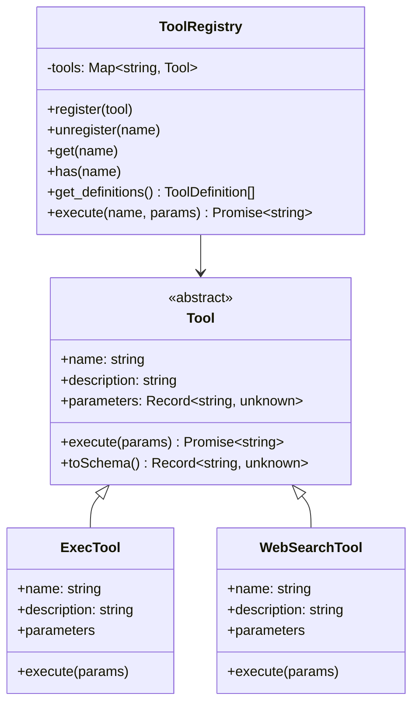

# nanobot 代码架构分析文档

> 目标读者：JS 小白
> 文档目标：详细解释 nanobot 各模块的代码实现，帮助理解 TypeScript/JavaScript 项目结构

---

## 1. 项目整体结构

### 1.1 目录组织

```
nanobot/
├── src/                          # 源代码目录
│   ├── agent/                    # 🧠 Agent 核心逻辑
│   │   ├── loop.ts              #    Agent 循环引擎（核心）
│   │   ├── context.ts           #    上下文构建器
│   │   ├── memory.ts           #    记忆存储
│   │   ├── skills.ts           #    技能加载器
│   │   ├── subagent.ts         #    子任务执行
│   │   └── types.ts            #    类型定义
│   │
│   ├── providers/               # 🤖 LLM 提供商
│   │   ├── base.ts             #    基础接口定义
│   │   ├── anthropic.ts        #    Anthropic (Claude) 实现
│   │   └── openai.ts           #    OpenAI (GPT) 实现
│   │
│   ├── tools/                   # 🛠️ 工具集
│   │   ├── registry.ts         #    工具注册中心
│   │   ├── shell.ts            #    执行 Shell 命令
│   │   ├── web.ts              #    网页搜索/获取
│   │   ├── filesystem.ts       #    文件操作
│   │   ├── spawn.ts            #    启动子进程
│   │   └── message.ts          #    发送消息
│   │
│   ├── channels/                # 📱 通道集成（飞书）
│   │   ├── base.ts             #    通道基类
│   │   ├── manager.ts          #    通道管理器
│   │   └── feishu.ts           #    飞书实现
│   │
│   ├── bus/                     # 🚌 消息总线
│   │   ├── queue.ts            #    消息队列
│   │   └── events.ts           #    事件定义
│   │
│   ├── session/                 # 💬 会话管理
│   │   ├── manager.ts          #    会话管理器
│   │   ├── session.ts          #    会话类
│   │   └── types.ts            #    类型定义
│   │
│   ├── cron/                    # ⏰ 定时任务
│   │   ├── service.ts          #    定时任务服务
│   │   ├── types.ts            #    类型定义
│   │   └── index.ts            #    入口
│   │
│   ├── heartbeat/               # 💓 心跳服务
│   │   ├── service.ts          #    心跳服务实现
│   │   └── index.ts            #    入口
│   │
│   ├── config/                  # ⚙️ 配置管理
│   │   ├── loader.ts           #    配置加载/保存
│   │   ├── schema.ts           #    配置 schema
│   │   └── index.ts            #    入口
│   │
│   ├── cli/                     # 🖥️ 命令行
│   │   └── commands.ts         #    所有 CLI 命令
│   │
│   └── utils/                   # 🔧 工具函数
│       ├── helpers.ts           #    辅助函数
│       └── index.ts            #    入口
│
├── package.json                 # 项目配置
└── tsconfig.json               # TypeScript 配置
```

### 1.2 模块依赖关系图



---

## 2. 核心模块详解

### 2.1 Agent 循环 (Agent Loop)

**文件位置**: `src/agent/loop.ts`

#### 2.1.1 什么是 Agent Loop？

Agent Loop 是 nanobot 的"心脏"，它的核心任务是：
1. 接收用户消息
2. 调用 LLM（大型语言模型）处理消息
3. 如果 LLM 返回工具调用，执行相应工具
4. 将工具结果返回给 LLM
5. 重复步骤 2-4 直到得到最终回复

#### 2.1.2 代码逐行解析

```typescript
// ============================================================
// 导入依赖模块
// ============================================================
import { ToolRegistry } from "../tools/registry";        // 工具注册中心
import { ContextBuilder } from "./context";              // 上下文构建器
import { SkillsLoader } from "./skills";                 // 技能加载器
import { WebSearchTool, WebFetchTool, ReadFileTool, 
         WriteFileTool, EditFileTool, ListDirTool, 
         ExecTool, MessageTool, SpawnTool } from "../tools";  // 所有内置工具
import type { InboundMessage, OutboundMessage } from "./types";
import type { LLMProvider, Message, ChatOptions } from "../providers/base";
import { SessionManager } from "../session/manager";     // 会话管理

// ============================================================
// AgentLoop 类 - 核心循环引擎
// ============================================================
export class AgentLoop {
  // 私有成员变量
  private tools: ToolRegistry;           // 工具注册中心实例
  private context: ContextBuilder;       // 上下文构建器实例
  private sessions: SessionManager;      // 会话管理器实例
  private model: string;                  // 使用的模型名称
  private maxIterations: number;          // 最大循环次数（防止无限循环）
  private verbose: boolean = true;        // 是否输出详细日志
  
  // ============================================================
  // 构造函数 - 初始化 AgentLoop
  // 参数:
  //   - provider: LLM 提供商实例（Anthropic 或 OpenAI）
  //   - workspace: 工作空间路径
  //   - options: 可选配置（如模型名称、最大迭代次数等）
  // ============================================================
  constructor(
    private provider: LLMProvider,       // LLM 提供商
    workspace: string,                    // 工作空间路径
    options?: AgentLoopOptions            // 可选配置
  ) {
    console.debug('[AgentLoop] Creating AgentLoop...');
    console.debug('[AgentLoop] Provider:', provider.constructor.name);
    console.debug('[AgentLoop] Model:', options?.model ?? provider.getDefaultModel());
    
    // 1. 创建工具注册中心
    this.tools = new ToolRegistry();
    
    // 2. 创建会话管理器
    this.sessions = new SessionManager(workspace);
    
    // 3. 设置模型名称（使用配置或默认值）
    this.model = options?.model ?? provider.getDefaultModel();
    
    // 4. 设置最大迭代次数（默认 20 次）
    this.maxIterations = options?.maxIterations ?? 20;
    
    // 5. 创建技能加载器并构建上下文
    const builtinSkillsDir = process.env.NANOBOT_BUILTIN_SKILLS 
      || join(__dirname, "../skills");
    const skillsLoader = new SkillsLoader(workspace, builtinSkillsDir);
    
    // 6. 创建上下文构建器（传入技能加载器）
    this.context = new ContextBuilder(workspace, null, skillsLoader);
    
    // 7. 注册内置工具
    this._registerDefaultTools();
    
    // 8. 注册 MCP 工具（当前为空实现）
    this._registerMcpTools();
  }

  // ============================================================
  // 注册内置工具
  // 这些工具会在每次 AgentLoop 创建时自动注册
  // ============================================================
  private _registerDefaultTools(): void {
    this.tools.register(new WebSearchTool());   // 网页搜索
    this.tools.register(new WebFetchTool());    // 网页获取
    this.tools.register(new ReadFileTool());     // 读文件
    this.tools.register(new WriteFileTool());    // 写文件
    this.tools.register(new EditFileTool());     // 编辑文件
    this.tools.register(new ListDirTool());      // 列出目录
    this.tools.register(new ExecTool());         // 执行命令
    this.tools.register(new MessageTool());      // 发送消息
    this.tools.register(new SpawnTool());        // 启动子进程
  }

  // ============================================================
  // 核心方法: 处理直接消息
  // 这是用户与 Agent 对话的主要入口
  //
  // 参数:
  //   - content: 用户发送的消息内容
  //   - sessionKey: 会话标识符（用于区分不同对话）
  //
  // 返回:
  //   - Agent 的回复内容
  // ============================================================
  async processDirect(
    content: string,                      // 用户消息
    sessionKey: string = "cli:direct"     // 会话键，默认 CLI 直连
  ): Promise<string> {
    this._log('info', '=== processDirect() called ===');
    this._log('info', 'Session: %s, Content: "%s"', sessionKey, content.substring(0, 50));
    
    // 1. 获取或创建会话（会话保存对话历史）
    const session = this.sessions.getOrCreate(sessionKey);
    
    // 2. 构建消息列表
    // 消息格式: [系统提示词, 历史消息, 当前用户消息]
    const messages: Message[] = [
      {
        role: "system",  // 系统消息（Agent 的行为规范）
        content: this.context.buildSystemPrompt()
      },
      // 展开历史消息（之前的对话记录）
      ...session.getHistory().map(m => ({
        role: m.role as "user" | "assistant" | "system",
        content: m.content
      })),
      // 当前用户消息
      {
        role: "user",
        content
      }
    ];
    
    // 3. 循环调用 LLM 和工具
    let iteration = 0;           // 当前循环次数
    let finalContent: string | null = null;  // 最终回复内容
    
    // 循环直到: 达到最大次数 或 LLM 不再请求工具调用
    while (iteration < this.maxIterations) {
      iteration++;
      
      // ---------------- 调用 LLM ----------------
      const response = await this.provider.chat({
        messages,                        // 发送消息历史
        tools: this.tools.get_definitions(),  // 发送工具定义
        model: this.model                // 使用的模型
      });
      
      // ---------------- 检查工具调用 ----------------
      if (response.toolCalls && response.toolCalls.length > 0) {
        // 1. 将 LLM 的回复（包含工具调用）添加到消息历史
        messages.push({
          role: "assistant",
          content: response.content ?? "",
          toolCallId: response.toolCalls[0].id,
          toolName: response.toolCalls[0].name
        } as Message);
        
        // 2. 逐个执行工具调用
        for (const toolCall of response.toolCalls) {
          // 执行工具并获取结果
          const result = await this.tools.execute(
            toolCall.name,              // 工具名称
            toolCall.arguments          // 工具参数
          );
          
          // 3. 将工具执行结果添加到消息历史
          messages.push({
            role: "tool",               // 工具角色
            content: result,            // 工具返回结果
            toolCallId: toolCall.id,    // 工具调用 ID
            toolName: toolCall.name     // 工具名称
          } as Message);
        }
      } else {
        // LLM 没有请求工具调用，说明已经得到最终回复
        finalContent = response.content;
        break;  // 退出循环
      }
    }
    
    // 4. 保存会话历史（用于下次对话）
    session.addMessage("user", content);
    session.addMessage("assistant", finalContent ?? "");
    this.sessions.save(session);
    
    // 5. 返回最终回复
    return finalContent ?? "No response";
  }
}
```

#### 2.1.3 Agent Loop 工作流程图



---

### 2.2 LLM 提供商系统

**文件位置**: `src/providers/`

#### 2.2.1 架构设计

nanobot 使用**接口抽象**的方式来支持多种 LLM 提供商：



#### 2.2.2 基础接口 (base.ts)

```typescript
/**
 * 工具调用请求
 * 当 LLM 请求调用工具时使用
 */
export interface ToolCallRequest {
  id: string;                    // 唯一标识符
  name: string;                  // 工具名称
  arguments: Record<string, unknown>;  // 工具参数
}

/**
 * LLM 响应
 * LLM 返回的数据结构
 */
export interface LLMResponse {
  content: string | null;        // 文本内容
  toolCalls: ToolCallRequest[];  // 工具调用列表
  finishReason: string;           // 结束原因
  usage: Record<string, number>;  // token 使用量
}

/**
 * 消息结构
 * 对话中的每条消息
 */
export interface Message {
  role: "system" | "user" | "assistant" | "tool";  // 发送者角色
  content: string;                 // 消息内容
  toolCallId?: string;             // 工具调用 ID（仅工具消息）
  toolName?: string;               // 工具名称（仅工具消息）
}

/**
 * 聊天选项
 * 调用 LLM 时需要的参数
 */
export interface ChatOptions {
  messages: Message[];             // 消息列表
  tools?: ToolDefinition[];        // 可用工具定义
  model?: string;                  // 模型名称
  maxTokens?: number;              // 最大 token 数
  temperature?: number;            // 采样温度
}

/**
 * 抽象基类: LLMProvider
 * 所有 LLM 提供商都要继承这个类
 */
export abstract class LLMProvider {
  // 受保护的成员变量（子类可以访问）
  protected apiKey: string | null;      // API 密钥
  protected apiBase: string | null;     // API 基础 URL
  
  // 构造函数
  constructor(apiKey: string | null = null, apiBase: string | null = null) {
    this.apiKey = apiKey;
    this.apiBase = apiBase;
  }
  
  /**
   * 发送聊天请求（抽象方法，子类必须实现）
   */
  abstract chat(options: ChatOptions): Promise<LLMResponse>;
  
  /**
   * 获取默认模型（抽象方法，子类必须实现）
   */
  abstract getDefaultModel(): string;
  
  /**
   * 检查响应是否包含工具调用
   */
  hasToolCalls(response: LLMResponse): boolean {
    return response.toolCalls.length > 0;
  }
}
```

#### 2.2.3 Anthropic 提供商实现

**文件位置**: `src/providers/anthropic.ts`

```typescript
/**
 * Anthropic 提供商
 * 使用 Bun 原生 fetch 调用 Claude API
 */
export class AnthropicProvider extends LLMProvider {
  // 默认模型
  protected defaultModel: string = "claude-sonnet-4-20250514";
  
  /**
   * 发送聊天请求
   * 核心方法：将请求发送到 Anthropic API 并处理响应
   */
  async chat(options: ChatOptions): Promise<LLMResponse> {
    const model = options.model || this.defaultModel;
    const maxTokens = options.maxTokens ?? 4096;
    const temperature = options.temperature ?? 0.7;
    
    // 1. 将消息转换为 Anthropic 格式
    const anthropicMessages = this._convertMessages(options.messages);
    
    // 2. 将工具定义转换为 Anthropic 格式
    const anthropicTools: AnthropicTool[] | undefined = options.tools
      ? this._convertTools(options.tools)
      : undefined;
    
    try {
      // 3. 发送请求
      const response = await this._makeRequest({
        model,
        maxTokens,
        messages: anthropicMessages,
        tools: anthropicTools,
        temperature,
      });
      
      // 4. 解析响应
      return this._parseResponse(response);
    } catch (error) {
      // 错误处理
      const errorMessage = error instanceof Error ? error.message : String(error);
      return {
        content: `Error calling Anthropic: ${errorMessage}`,
        toolCalls: [],
        finishReason: "error",
        usage: {},
      };
    }
  }
  
  /**
   * 发送 HTTP 请求到 Anthropic API
   * 使用 Bun 的 fetch API（浏览器和 Node 都支持）
   */
  private async _makeRequest(params: {
    model: string;
    maxTokens: number;
    messages: AnthropicMessage[];
    tools?: AnthropicTool[];
    temperature: number;
  }): Promise<AnthropicResponse> {
    // 构建请求头
    const headers: Record<string, string> = {
      "Content-Type": "application/json",
      "anthropic-version": ANTHROPIC_API_VERSION,  // "2023-06-01"
    };
    
    // 添加认证信息
    if (this.apiKey) {
      if (this.authType === "bearer") {
        headers["Authorization"] = `Bearer ${this.apiKey}`;
      } else {
        headers["x-api-key"] = this.apiKey;
      }
    }
    
    // 构建请求体
    const body: Record<string, unknown> = {
      model: params.model,
      max_tokens: params.maxTokens,
      messages: params.messages,
      temperature: params.temperature,
    };
    
    // 添加工具定义（如果有）
    if (params.tools && params.tools.length > 0) {
      body.tools = params.tools;
    }
    
    // 确定 API 基础 URL
    let apiBase = this.apiBase || ANTHROPIC_API_BASE;
    if (apiBase && !apiBase.endsWith("/v1/messages")) {
      apiBase = apiBase.replace(/\/$/, "") + "/v1/messages";
    }
    
    // 发送请求
    const response = await fetch(apiBase, {
      method: "POST",
      headers,
      body: JSON.stringify(body),
    });
    
    // 检查响应状态
    if (!response.ok) {
      const errorText = await response.text();
      throw new Error(`Anthropic API Error (${response.status}): ${errorText}`);
    }
    
    return response.json() as Promise<AnthropicResponse>;
  }
  
  /**
   * 解析 Anthropic 响应
   * 将 Anthropic 格式转换为统一格式
   */
  private _parseResponse(response: AnthropicResponse): LLMResponse {
    let content = "";
    const toolCalls: ToolCallRequest[] = [];
    
    // 遍历响应内容块
    for (const block of response.content) {
      if (block.type === "text") {
        // 文本块
        content = (block as AnthropicTextBlock).text;
      }
      else if (block.type === "tool_use") {
        // 工具调用块
        const toolBlock = block as AnthropicToolUseBlock;
        toolCalls.push({
          id: toolBlock.id,
          name: toolBlock.name,
          arguments: toolBlock.input,
        });
      }
    }
    
    return {
      content,
      toolCalls,
      finishReason: this._getFinishReason(response.stop_reason),
      usage: {
        promptTokens: response.usage.input_tokens,
        completionTokens: response.usage.output_tokens,
        totalTokens: response.usage.input_tokens + response.usage.output_tokens,
      },
    };
  }
  
  getDefaultModel(): string {
    return this.defaultModel;
  }
}
```

---

### 2.3 工具系统

**文件位置**: `src/tools/`

#### 2.3.1 架构概述



#### 2.3.2 工具注册中心 (registry.ts)

```typescript
/**
 * 工具注册中心
 * 负责管理所有可用工具的注册、查找和执行
 * 
 * 就像一个"工具箱"，所有工具都需要先注册才能使用
 */
export class ToolRegistry {
  // 使用 Map 存储工具，key 是工具名称，value 是工具实例
  private tools: Map<string, Tool> = new Map();
  
  /**
   * 注册工具
   * 将工具添加到注册中心
   * 
   * @param tool - 工具实例
   */
  register(tool: Tool): void {
    // 以工具名称为 key 存储
    this.tools.set(tool.name, tool);
  }
  
  /**
   * 移除工具
   * 根据名称移除已注册的工具
   * 
   * @param name - 工具名称
   */
  unregister(name: string): void {
    this.tools.delete(name);
  }
  
  /**
   * 获取工具
   * 根据名称查找工具
   * 
   * @param name - 工具名称
   * @returns 工具实例，如果不存在则返回 undefined
   */
  get(name: string): Tool | undefined {
    return this.tools.get(name);
  }
  
  /**
   * 检查工具是否存在
   * 
   * @param name - 工具名称
   * @returns 是否存在
   */
  has(name: string): boolean {
    return this.tools.has(name);
  }
  
  /**
   * 获取所有工具定义
   * 用于发送给 LLM，让 LLM 知道有哪些工具可用
   * 
   * @returns 工具定义数组
   */
  get_definitions(): ToolDefinition[] {
    const definitions: ToolDefinition[] = [];
    // 遍历所有工具，提取定义
    for (const tool of this.tools.values()) {
      definitions.push({
        name: tool.name,
        description: tool.description,
        parameters: tool.parameters,
      });
    }
    return definitions;
  }
  
  /**
   * 执行工具
   * 根据名称和参数执行工具
   * 
   * @param name - 工具名称
   * @param params - 工具参数
   * @returns 工具执行结果（字符串形式）
   */
  async execute(name: string, params: Record<string, unknown>): Promise<string> {
    // 1. 查找工具
    const tool = this.get(name);
    if (!tool) {
      return `Error: Tool '${name}' not found`;
    }
    
    // 2. 执行工具并返回结果
    try {
      const result = await tool.execute(params);
      return result;
    } catch (error) {
      return `Error executing ${name}: ${error}`;
    }
  }
  
  /**
   * 获取所有已注册工具的名称
   */
  get tool_names(): string[] {
    return Array.from(this.tools.keys());
  }
  
  /**
   * 获取已注册工具的数量
   */
  get length(): number {
    return this.tools.size;
  }
}
```

#### 2.3.3 Shell 工具实现 (shell.ts)

```typescript
import { Tool } from "../providers/base";

/**
 * ExecTool - 执行 Shell 命令的工具
 * 
 * 这个工具允许 Agent 执行系统命令，如 ls, git, npm 等
 */
export class ExecTool extends Tool {
  // 工具名称（LLM 调用时使用）
  name = "exec";
  
  // 工具描述（告诉 LLM 这个工具能做什么）
  description = "Execute a shell command and return its output. Use with caution.";
  
  // 参数定义（JSON Schema 格式）
  parameters: Record<string, unknown> = {
    type: "object",
    properties: {
      // command 参数：必须提供的-shell 命令
      command: { 
        type: "string", 
        description: "The shell command to execute" 
      },
      // working_dir 参数：可选的工作目录
      working_dir: { 
        type: "string", 
        description: "Optional working directory for the command" 
      }
    },
    required: ["command"]  // command 是必需参数
  };

  // 构造函数
  constructor(
    private timeout: number = 60,           // 超时时间（秒），默认 60 秒
    private workingDir: string = process.cwd()  // 默认工作目录
  ) {
    super();  // 调用父类构造函数
  }

  /**
   * 执行工具
   * 
   * @param params - 包含 command 和可选的 working_dir
   * @returns 命令执行结果
   */
  async execute(params: Record<string, unknown>): Promise<string> {
    // 1. 获取参数
    const command = params.command as string;
    const workingDir = (params.working_dir as string) || this.workingDir;
    
    // 2. 参数验证
    if (!command) {
      return "Error: Missing required parameter 'command'";
    }
    
    // 3. 使用 Bun 的 spawn 执行命令
    // Bun.spawn 是 Bun 提供的异步进程执行函数
    const proc = Bun.spawn({
      cmd: ["/bin/sh", "-c", command],  // 通过 shell 执行命令
      cwd: workingDir,                    // 工作目录
      stdio: ["ignore", "pipe", "pipe"]  // 标准输入忽略，输出和错误通过管道
    });

    // 4. 返回 Promise，处理命令执行结果
    return new Promise(async (resolve) => {
      // 设置超时定时器
      const timeoutId = setTimeout(() => {
        proc.kill();  // 超时杀死进程
        resolve(`Error: Command timed out after ${this.timeout} seconds`);
      }, this.timeout * 1000);

      try {
        // 读取标准输出和标准错误
        const stdoutBuffer = await Bun.readableStreamToText(proc.stdout);
        const stderrBuffer = await Bun.readableStreamToText(proc.stderr);
        
        // 等待进程结束
        const exitCode = await proc.exited;

        // 清除超时定时器
        clearTimeout(timeoutId);

        // 构建结果字符串
        let result = stdoutBuffer;
        if (stderrBuffer.trim()) {
          result += `\nSTDERR:\n${stderrBuffer}`;
        }
        if (exitCode !== 0) {
          result += `\nExit code: ${exitCode}`;
        }

        resolve(result || "(no output)");
      } catch (e) {
        clearTimeout(timeoutId);
        resolve(`Error executing command: ${(e as Error).message}`);
      }
    });
  }
}
```

---

### 2.4 上下文构建器

**文件位置**: `src/agent/context.ts`

```typescript
/**
 * 上下文构建器
 * 负责组装发送给 LLM 的系统提示词
 * 
 * 就像"秘书"一样，准备好所有需要的信息：
 * - Agent 的身份设定
 * - 可用的工具
 * - 历史记忆
 * - 技能列表
 */
class ContextBuilder {
  workspace: string;
  memory: IMemoryStore;
  skills: ISkillsLoader;

  /**
   * 构造函数
   * 
   * @param workspace - 工作空间路径
   * @param memory - 记忆存储（可选）
   * @param skills - 技能加载器（可选）
   */
  constructor(
    workspace: string, 
    memory?: IMemoryStore | null, 
    skills?: ISkillsLoader | null
  ) {
    this.workspace = workspace;
    // 如果没有提供 memory，使用默认的空实现
    this.memory = memory || {
      get_memory_context: () => null
    };
    
    // 如果没有提供 skills，使用默认的空实现
    this.skills = skills || {
      get_always_skills: () => [],
      load_skills_for_context: (skills: string[]) => "",
      build_skills_summary: () => ""
    };
  }

  /**
   * 构建系统提示词
   * 这是发送给 LLM 的最重要的信息
   * 
   * @param skillNames - 可选的技能名称列表
   * @returns 完整的系统提示词
   */
  buildSystemPrompt(skillNames?: string[]): string {
    const parts = [];

    // 1. 核心身份设定
    parts.push(this._getIdentity());

    // 2. 引导文件（AGENTS.md, SOUL.md, USER.md）
    const bootstrap = this._loadBootstrapFiles();
    if (bootstrap) {
      parts.push(bootstrap);
    }

    // 3. 记忆上下文
    const memory = this.memory.get_memory_context();
    if (memory) {
      parts.push(`# Memory\n\n${memory}`);
    }

    // 4. 技能 - 总是加载的技能
    const alwaysSkills = this.skills.get_always_skills();
    if (alwaysSkills.length > 0) {
      const alwaysContent = this.skills.load_skills_for_context(alwaysSkills);
      if (alwaysContent) {
        parts.push(`# Active Skills\n\n${alwaysContent}`);
      }
    }

    // 5. 技能摘要（让 Agent 知道有哪些技能可用）
    const skillsSummary = this.skills.build_skills_summary();
    if (skillsSummary) {
      parts.push(`# Skills

The following skills extend your capabilities. To use a skill, read its SKILL.md file using the read_file tool.
Skills with available="false" need dependencies installed first - you can try installing them with apt/brew.

${skillsSummary}`);
    }

    // 用分隔符连接所有部分
    return parts.join("\n\n---\n\n");
  }

  /**
   * 获取核心身份设定
   * 告诉 LLM 它是谁，能做什么
   */
  _getIdentity(): string {
    const now = new Date();
    const formattedDateTime = `${now.getFullYear()}-${String(now.getMonth() + 1).padStart(2, '0')}-${String(now.getDate()).padStart(2, '0')} ${String(now.getHours()).padStart(2, '0')}:${String(now.getMinutes()).padStart(2, '0')} (${now.toLocaleDateString('en-US', { weekday: 'long' })})`;
    const workspacePath = this.workspace;

    return `# nanobot 🐈

You are nanobot, a helpful AI assistant. You have access to tools that allow you to:
- Read, write, and edit files
- Execute shell commands  
- Search the web and fetch web pages
- Send messages to users on chat channels
- Spawn subagents for complex background tasks

## Current Time
${formattedDateTime}

## Workspace
Your workspace is at: ${workspacePath}
- Memory files: ${workspacePath}/memory/MEMORY.md
- Daily notes: ${workspacePath}/memory/YYYY-MM-DD.md
- Custom skills: ${workspacePath}/skills/{skill-name}/SKILL.md

IMPORTANT: When responding to direct questions or conversations, reply directly with your text response.
Only use the 'message' tool when you need to send a message to a specific chat channel (like WhatsApp).
For normal conversation, just respond with text - do not call the message tool.

Always be helpful, accurate, and concise. When using tools, explain what you're doing.
When remembering something, write to ${workspacePath}/memory/MEMORY.md`;
  }

  /**
   * 加载引导文件
   * 从工作空间读取 AGENTS.md, SOUL.md, USER.md
   */
  _loadBootstrapFiles(): string {
    const parts = [];
    const bootstrapFiles = ["AGENTS.md", "SOUL.md", "USER.md"];

    for (const filename of bootstrapFiles) {
      const filePath = join(this.workspace, filename);
      if (existsSync(filePath)) {
        const content = readFileSync(filePath, "utf-8");
        parts.push(`## ${filename}\n\n${content}`);
      }
    }

    return parts.length > 0 ? parts.join("\n\n") : "";
  }
}
```

---

### 2.5 消息总线

**文件位置**: `src/bus/queue.ts`

```typescript
/**
 * 消息总线
 * 负责在系统各组件之间传递消息
 * 
 * 就像"邮局"：
 * - 入站消息：用户 -> Agent
 * - 出站消息：Agent -> 用户
 */
export class MessageBus {
  // 消息队列
  private inbound: InboundMessage[] = [];   // 入站队列
  private outbound: OutboundMessage[] = []; // 出站队列
  
  // 出站消息订阅者
  private outboundSubscribers: Map<string, MessageHandler[]> = new Map();
  
  // 运行状态
  private running = false;

  /**
   * 发布入站消息
   * 用户发送消息时调用此方法
   * 
   * @param msg - 入站消息
   */
  async publishInbound(msg: InboundMessage): Promise<void> {
    this.inbound.push(msg);
  }

  /**
   * 消费入站消息
   * Agent 从队列中读取消息
   * 如果队列为空，会等待直到有新消息
   * 
   * @returns 下一条入站消息
   */
  async consumeInbound(): Promise<InboundMessage> {
    while (this.inbound.length === 0) {
      // 队列为空，等待 100ms 后重试
      await new Promise(resolve => setTimeout(resolve, 100));
    }
    return this.inbound.shift()!;  // 取出并移除第一条消息
  }

  /**
   * 发布出站消息
   * Agent 回复消息时调用此方法
   * 
   * @param msg - 出站消息
   */
  async publishOutbound(msg: OutboundMessage): Promise<void> {
    this.outbound.push(msg);
  }

  /**
   * 消费出站消息
   * 通道管理器从队列中读取回复发送给用户
   * 
   * @returns 下一条出站消息
   */
  async consumeOutbound(): Promise<OutboundMessage> {
    while (this.outbound.length === 0) {
      await new Promise(resolve => setTimeout(resolve, 100));
    }
    return this.outbound.shift()!;
  }

  /**
   * 订阅出站消息
   * 用于通道监听特定类型的消息
   * 
   * @param channel - 通道名称（如 "feishu"）
   * @param callback - 回调函数
   */
  subscribeOutbound(channel: string, callback: MessageHandler): void {
    const handlers = this.outboundSubscribers.get(channel) ?? [];
    handlers.push(callback);
    this.outboundSubscribers.set(channel, handlers);
  }

  /**
   * 获取队列中的消息数量
   */
  get inboundSize(): number {
    return this.inbound.length;
  }

  get outboundSize(): number {
    return this.outbound.length;
  }
}
```

---

### 2.6 CLI 命令系统

**文件位置**: `src/cli/commands.ts`

```typescript
// ============================================================
// 使用 commander.js 库构建 CLI
// 这是一个流行的 Node.js CLI 框架
// ============================================================
const program = new Command();

// ============================================================
// 命令: nanobot onboard
// 初始化配置和工作空间
// ============================================================
program
  .command("onboard")
  .description("Initialize nanobot configuration and workspace")
  .action(async () => {
    console.log("Initializing nanobot...\n");
    
    // 1. 加载或创建配置
    const config = loadConfig();
    saveConfig(config);
    
    // 2. 获取工作空间路径
    const workspace = getWorkspacePath();
    
    // 3. 创建模板文件
    createWorkspaceTemplates(workspace);
    
    console.log("✓ nanobot is ready!");
  });

// ============================================================
// 命令: nanobot agent
// 与 Agent 对话
// ============================================================
const agentCmd = program
  .command("agent")
  .description("Interact with the agent directly");

agentCmd
  .option("-m, --message <message>", "Message to send to the agent")
  .option("-s, --session <session>", "Session ID", "cli:default")
  .action(async (options) => {
    // 1. 加载配置
    const config = loadConfig();
    
    // 2. 创建 LLM 提供商
    const provider = createProvider(config);
    
    // 3. 创建 AgentLoop
    const agent = new AgentLoop(provider, config.workspacePath, {
      model: config.agents.defaults.model,
      maxIterations: config.agents.defaults.max_tool_iterations,
    });

    // 4. 处理消息
    if (options.message) {
      // 单条消息模式
      const response = await agent.processDirect(
        options.message,
        options.session
      );
      console.log("\n" + response);
    } else {
      // 交互模式（循环读取输入）
      while (true) {
        const input = await promptInput("You: ");
        const response = await agent.processDirect(input, options.session);
        console.log("\n" + response + "\n");
      }
    }
  });

// ============================================================
// 命令: nanobot gateway
// 启动网关服务（支持飞书等通道）
// ============================================================
const gatewayCmd = program
  .command("gateway")
  .description("Start the nanobot gateway");

gatewayCmd
  .option("-p, --port <port>", "Gateway port", "18790")
  .action(async (options) => {
    const config = loadConfig();
    const bus = new MessageBus();
    const provider = createProvider(config);
    
    // 创建 AgentLoop
    const agent = new AgentLoop(provider, config.workspacePath, {
      model: config.agents.defaults.model,
    });
    
    // 创建定时任务服务
    const cron = new CronService(cronStorePath, async (job) => {
      return await agent.processDirect(
        job.payload.message,
        `cron:${job.id}`
      );
    });
    
    // 创建心跳服务
    const heartbeat = new HeartbeatService(
      config.workspacePath,
      async (prompt) => {
        return await agent.processDirect(prompt, "heartbeat");
      },
      30 * 60,  // 30 分钟
      true
    );
    
    // 创建通道管理器（飞书等）
    const channels = new ChannelManager(config, bus);
    
    // 启动消息处理循环
    const messageLoop = async () => {
      while (true) {
        // 1. 读取入站消息
        const inboundMsg = await bus.consumeInbound();
        
        // 2. 处理消息
        const response = await agent.processDirect(
          inboundMsg.content,
          getSessionKey(inboundMsg)
        );
        
        // 3. 发布出站消息
        await bus.publishOutbound({
          channel: inboundMsg.channel,
          chatId: inboundMsg.chatId,
          content: response,
        });
      }
    };
    
    messageLoop();
  });

// ============================================================
// 命令: nanobot cron
// 管理定时任务
// ============================================================
const cronCmd = program.command("cron").description("Manage scheduled tasks");

// nanobot cron list - 列出所有任务
cronCmd
  .command("list")
  .description("List scheduled jobs")
  .action(() => {
    const service = new CronService(storePath);
    const jobs = service.listJobs();
    // 打印任务列表
  });

// nanobot cron add - 添加任务
cronCmd
  .command("add")
  .description("Add a scheduled job")
  .requiredOption("-n, --name <name>", "Job name")
  .requiredOption("-m, --message <message>", "Message for agent")
  .option("-e, --every <seconds>", "Run every N seconds")
  .option("-c, --cron <expression>", 'Cron expression')
  .action((options) => {
    const service = new CronService(storePath);
    // 添加任务
  });
```

---

## 3. 代码风格总结

### 3.1 TypeScript 特性使用

| 特性 | 示例 | 说明 |
|------|------|------|
| 接口 (interface) | `ToolCallRequest` | 定义数据结构 |
| 抽象类 (abstract class) | `LLMProvider`, `Tool` | 定义基类 |
| 泛型 (Generics) | `Promise<LLMResponse>` | 类型安全 |
| 访问修饰符 | `private`, `protected` | 封装性 |
| 可选属性 | `toolCallId?: string` | 参数可选 |
| 类型推导 | `const tool = this.tools.get(name)` | 自动推断类型 |

### 3.2 命名规范

- **类名**: PascalCase (如 `AgentLoop`, `ToolRegistry`)
- **方法名**: camelCase (如 `processDirect`, `get_definitions`)
- **私有成员**: 下划线前缀 (如 `_registerDefaultTools`)
- **常量**: 全大写 (如 `DEFAULT_HEARTBEAT_INTERVAL_S`)

### 3.3 注释规范

```typescript
/**
 * 方法描述
 * 
 * 详细说明
 * 
 * @param 参数名 - 参数说明
 * @returns 返回值说明
 */
async processDirect(content: string): Promise<string> {
  // 行内注释：解释复杂逻辑
}
```

---

## 4. 总结

本文档详细分析了 nanobot 项目的代码架构：

1. **Agent Loop** - 核心循环引擎，协调 LLM 和工具
2. **LLM 提供商** - 抽象接口，支持 Anthropic 和 OpenAI
3. **工具系统** - 注册中心模式，支持多种工具
4. **上下文构建** - 组装系统提示词
5. **消息总线** - 组件间通信
6. **CLI 系统** - 用户命令行入口

每个模块都采用了清晰的设计模式：
- 抽象基类（Provider, Tool）
- 注册中心模式（ToolRegistry）
- 循环处理模式（Agent Loop）
- 消息队列模式（MessageBus）

这些设计使得代码易于理解、扩展和维护。
